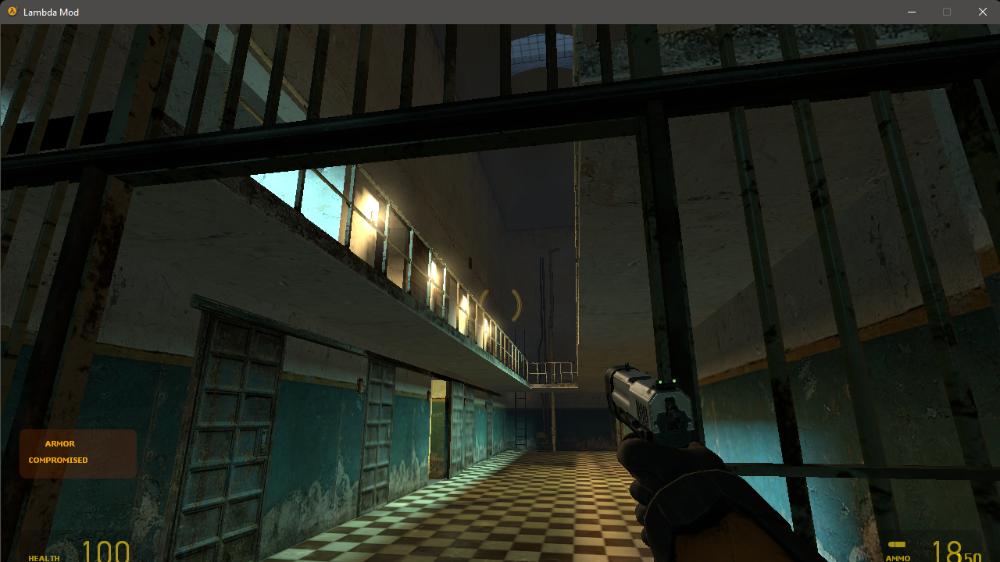

# SourceEngineRebuild

Another Source Engine Modified Version with some new features.

> ⚠️ Although the project is under the MIT license, the code of Source SDK repo and Source Engine are properties of Valve-Software. **For learning use only.**

---

## Features

- Full CMake builds
- C++17 compilable
- Minimal binary dependencies
- Fix many bugs
- Updated VGUI
- New lighting system
- Physically Based Rendering implementation [(thexa4/source-pbr)](https://github.com/thexa4/source-pbr)
- Shader Editor [(Biohazard90/SSE)](https://github.com/Biohazard90/source-shader-editor)
- Updated vbsp and hammer

---

Screenshots
--------------

##### Models for demo are from MMod

---

## IDE / Build tool - platform - compiler support

- Visual Studio 2019 - Windows - MSVC
- CMake (with ninja) - Windows - MSVC

---

## Build Instructions

### Only On Windows

You need to use CMake to generate project files, I recommend using CLion as your IDE here.

---

## Used third-party libraries

- [libspeex](https://www.speex.org/)
- [zlib](http://www.zlib.net/)
- [cryptopp](https://cryptopp.com/)
- [jpeglib](http://libjpeg.sourceforge.net/)
- [protobuf](https://github.com/protocolbuffers/protobuf)
- [lua](http://www.lua.org/)
- bzip2
- lzma

---

## License(s)

SourceEngineRebuild is a dual-licensed project.

- All the code that is left unchanged from the original Source SDK repo and Source Engine are licensed under the SDK license, see [LICENSE_SDK](https://github.com/cstom4994/ValveProjectCreatorFixes/blob/master/LICENSE_SDK) for details.
- All the remaining code that was directly contributed, unless explicitly stated is licensed under the MIT license.
- Please note that the code of Source SDK repo and Source Engine are properties of Valve-Software and any contributions that you make in it are considered a donation into the public domain.